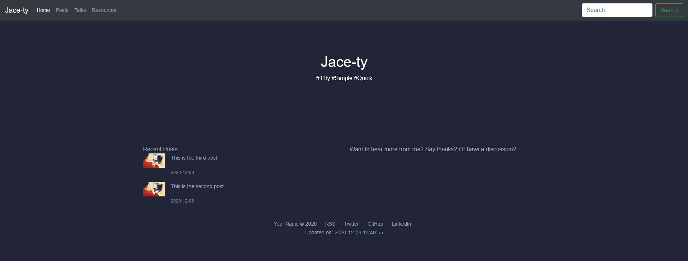

# Jace-ty

[See this live here](https://jace-ty.netlify.app)

[](https://app.netlify.com/sites/jace-ty/deploys)

Jace's opinionated template for 11ty.

This project scaffold includes:

- [Eleventy](https://11ty.dev)
- [Syntax highlighting](https://github.com/jacebenson/jace-ty/blob/main/.eleventy.js#L21)
- [Simple Site Search](https://github.com/jacebenson/jace-ty/blob/main/src/_includes/base.njk) <sup>see searchPosts function</sup>
- [RSS](https://github.com/jacebenson/jace-ty/blob/main/.eleventy.js#L4)
- A folder structure for each post with proper passthrough for files
- [Comments](https://github.com/jacebenson/jace-ty/blob/main/src/_includes/layouts/post-single.njk#L56) powered by [https://utteranc.es/](https://utteranc.es/)




## Instructions

To get your own instance of this 11ty starter project cloned and deploying to Netlify click the button below and follow the instructions.

[](https://app.netlify.com/start/deploy?repository=https://github.com/jacebenson/jace-ty)

### Wait, what happens when I click that button?

Good question. Here's what it will do...

1. Netlify will clone the git repository of this project into your Github account. It will be asking for permission to add the repo for you.
2. We'll create a new site for you in Netlify, and configure it to use your shiny new repo. Right away you'll be able to deploy changes by pushing code to your repo.
3. That's it.

### Update `./src/_data/site.js` to have your details

This file controls some features of the site

They should all be self explanatory.  A call out I have is;

Utteranc.es requires the repository to be public on github to work

## Creating Posts

This template uses generators to make the files and images for posts.  You can change how this works by modifying the code in ./generators.

One of the calls will generate the index.md, all the different image sizes needed for the templates.

```bash
yarn g post "This is the title of my post"
```

## Generators

I've added a few helpful scripts to help build things.

### Generic 

The main generator is `./generators/generic.js`

This will create or replace the index.md, and featured-*.webp files.

This searches pixabay for the title, if it doesn't find a result, it 
defaults to some random colors and objects until it finds something.

You call it by running this;

```bash
yarn g collection title #
#  1-^ 2-^        3-^
# 1 - g or generate
# 2 - so post or services or talk
# 3 - title the title of the post.  
# This renames the title to yyyy-mm-dd-title + title
# also replaces non-alphanumerics with `-`s
```

### DownloadImages

If you have a post and you want a different image but dont want to have resize them

```bash
yarn downloadImage ./src/post/my-first-post/ "search query"
#                   1-^                       2-^
# 1 - this is the folder that we'll be targeting to replace the images in
# 2 - search query to pass to pixabay, you dont need quotes if one word
#     if more than one word, you'll need to quote it.
```

### BuildImages

If you already have an image but you dont want to convert it this script is for you.

```bash
yarn buildImages ./src/post/my-first-post/featured.jpg
#                    1-^
# 1 - this is the image we'll be resizing and converting
#     this takes the image, creates a webp for the following
#     sizes, 100, 200, 320, 360, 640, 720, 960, 1280
#     These are specically used in the following templates
#     ./src/_includes/footer.njk
#     ./src/_includes/layouts/post.njk
#     This is also used in ./src/post/post.json
```


## Prerequisites

- [Node and NPM](https://nodejs.org/)

## Running locally

```bash
# install the dependencies
yarn # or npm i # if you dont have yarn

# It will then be available locally for building with
yarn serve # or npm run serve if you dont have yarn
```