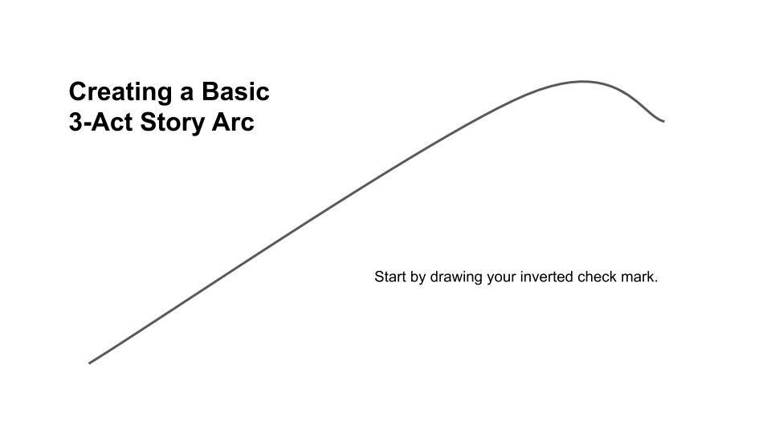
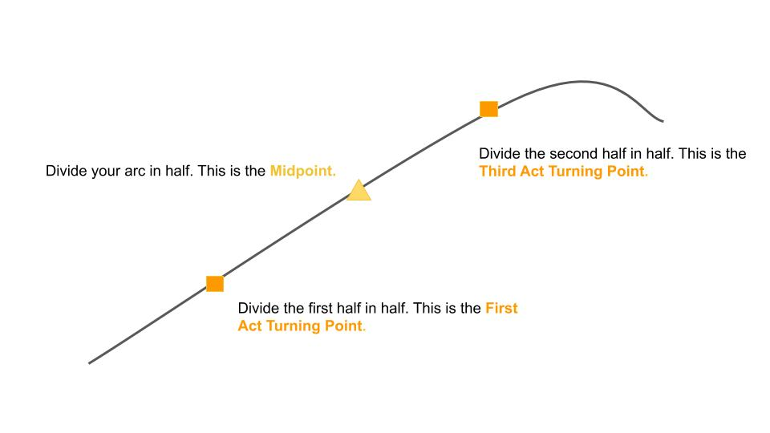
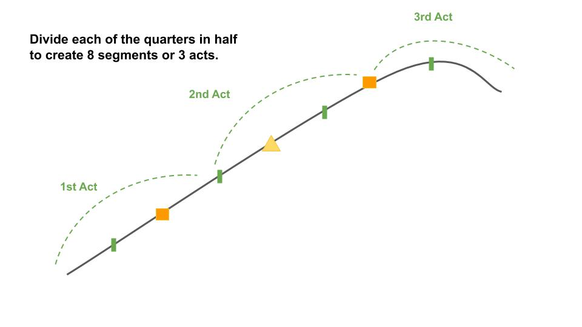
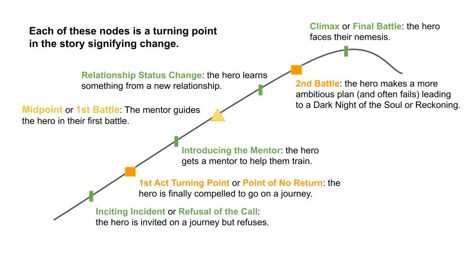
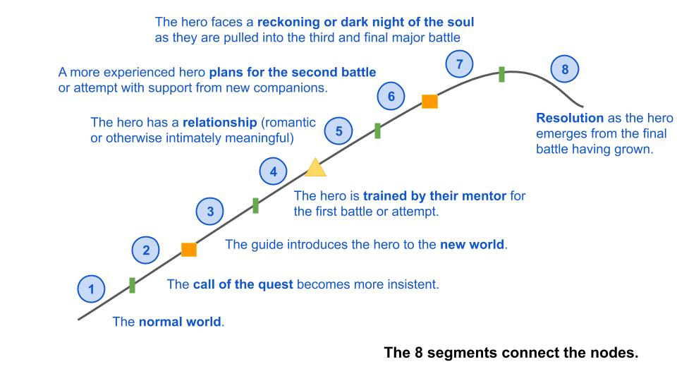
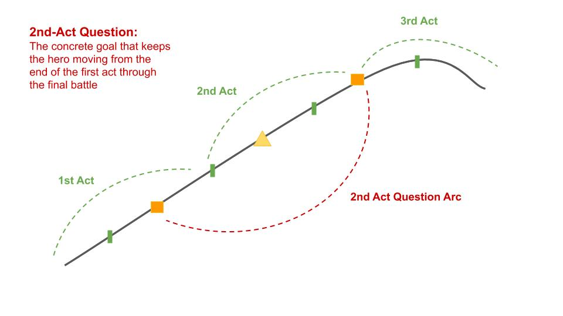
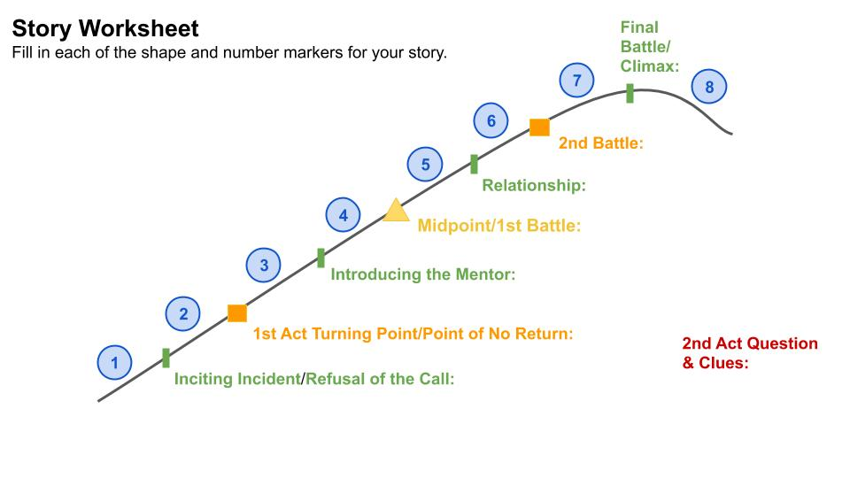
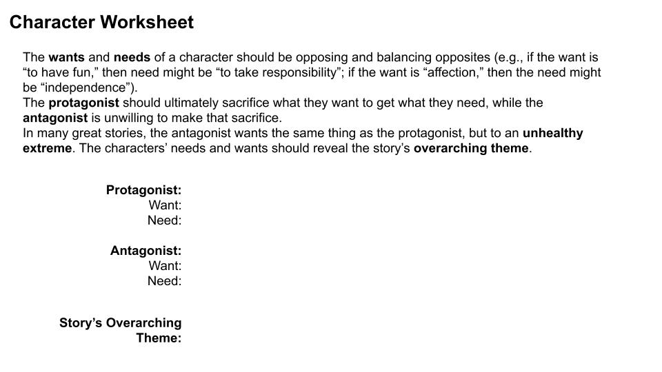

# Writing a story is hard

Authors use all sorts of tools, [lemontreelemur's worksheets] seem helpful to sort the story arcs and characters.  They were nice enough to share them on [Reddit].  I've add them here as I dont want to lose them.

# Story Arc Worksheets























# Character and Theme Worksheets





[lemontreelemur's worksheets]: https://www.reddit.com/r/writing/comments/kmuoao/basic_worksheets_for_story_character_craft/
[Reddit]: https://www.reddit.com/r/writing/comments/kmuoao/basic_worksheets_for_story_character_craft/